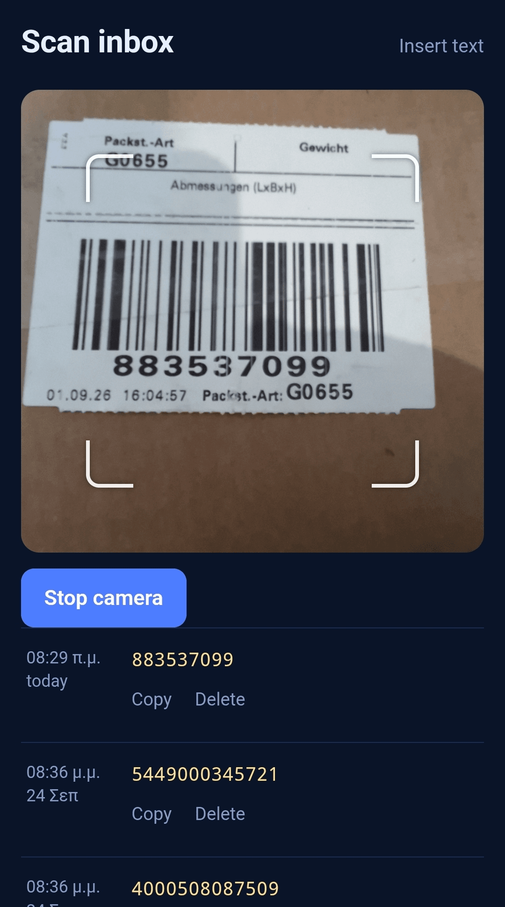
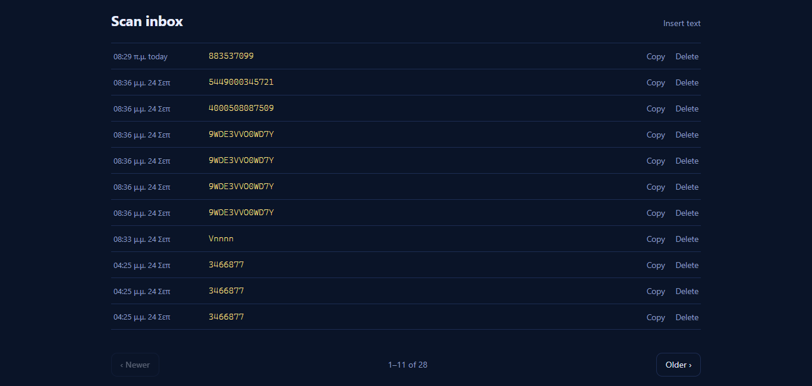

<p align="center">
  
</p>


# scan-inbox

Scan a QR code or barcode on your phone, read it back on any other device - a
laptop, another phone, a shared screen. No app to install, just a page in the
browser.

### Screenshots
<p align="center">
  
  
</p>

## Why

Sometimes you need to get a short piece of text (a code, a URL, a Wi-Fi
string, a serial number) off a label and onto a computer, with no cable and
no typing. Point your phone at it, and it shows up on the other screen a few
seconds later.

## How it works

- Open the site on your phone. It reads the camera with the browser's own
  barcode detector, so it handles QR codes, Data Matrix, Aztec, PDF417, and
  common 1D barcodes (Code 128, Code 39, EAN-13/8, UPC-A, ITF).
- Each scan is saved to a small database on the server.
- Open the same site on another device to see the list of everything
  scanned, newest first.
- Don't have a code to scan? Use the **Insert text** button to type or paste
  something in directly - it's saved the same way.
- Scans older than 6 months are cleaned up automatically.
- On a desktop screen the camera is hidden — desktop is for reading results,
  phones are for scanning. The list there is paged so it never scrolls; on
  a phone it pages 10 at a time.

## Before you deploy this - disclaimer

**Vibe-coded**. I'm into web developing and know my way around html, javascript, php etc 
but this little app was 100% vibe-coded with Claude. I did the best of my ability to check
the code but use the app completely at your own risk.

**There's no login built in.** Anyone who can reach the site can read and
add scans. Put it behind a reverse proxy with your own domain and an authorization provider.
Im using Caddy [Caddy](https://caddyserver.com/) and [Authelia](https://www.authelia.com/)

**It needs HTTPS.** Browsers only allow camera access on a secure page.
`localhost` also works for local testing, but a plain `http://` address on a
phone will not.

## Deploy it

You need Docker and Docker Compose on the server.

1. Download `docker-compose.yml` from this repo or create one based on the following example.

```
services:
  scan-inbox:
    image: ghcr.io/theogal/scan-inbox:latest
    container_name: scan-inbox
    restart: unless-stopped
    ports:
      - "127.0.0.1:8790:8000"   # loopback only; put a reverse proxy with login in front
    volumes:
      - scan-inbox-data:/data   # SQLite database lives here (scans.db)
      # optional: use ./static:/app/static:ro to override the html pages built into the image

volumes:
  scan-inbox-data:
    name: scan-inbox-data
```    

2. Start it:

   ```
   docker compose up
   ```

   The app listens on `127.0.0.1:8790`. Change the port on the left of the
   `:` in `docker-compose.yml` if that's already taken on your server.

3. Put a reverse proxy in front of it. Here's a minimal example for
   [Caddy](https://caddyserver.com/) with Authelia handling the login:

   ```
   yourdomain.com {
       forward_auth 127.0.0.1:9091 {
           uri /api/authz/forward-auth
           copy_headers Remote-User Remote-Groups Remote-Email Remote-Name
       }
       reverse_proxy 127.0.0.1:8790
   }
   ```


4. Open the site on your phone, allow camera access, and scan something. Visit the site on another device and copy the scanned data.

Your scans live in a Docker volume and are kept across updates.

### Customizing the pages

You can mount a local `./static` folder over the pages baked
into the image. Any file you place there - `index.html`, `app.js`,
`style.css` - overrides the built-in one; anything you leave out still comes
from the image.

## Tech

A single Python process (standard library only, no dependencies) serving a
small JSON API and the static pages, backed by SQLite. The camera and
barcode reading run entirely in the browser using the
[`BarcodeDetector`](https://developer.mozilla.org/en-US/docs/Web/API/Barcode_Detection_API)
API where available, with a bundled
[qr-scanner](https://github.com/mebjas/html5-qrcode) library as a QR-only
fallback for browsers without it.

## License

MIT - see [LICENSE](LICENSE).
